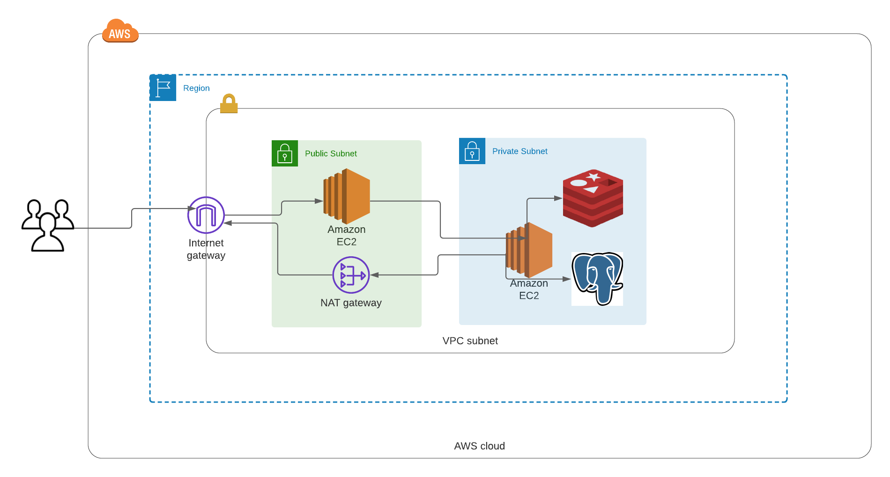
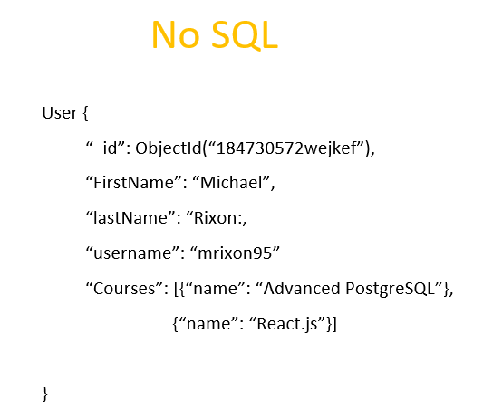

# Developer Workbook - Database Systems. Term3 Assignment 1 T3A1

# Question 1.

### Data Flow Diagram for Uber  

The above data flow diagram shows:
* the flow of data from public, admin and driver users
* what data is inputed and outputed by all the significant processes within the Uber app
* how the databases are used to both store and retrieve relevant data

### Explanation of the data flow in the diagram:

Public users need to initially enter in their name and credit card details before using the Uber app. This data gets sent to Uber and they store this data in a database. This data is later retrieved when the public user decides to order an Uber ride. For example, after ordering an Uber, the name of the person ordering the Uber gets retrieved from the database and sent to the Uber driver who is picking them up. This is so the driver can check their name before the public user enters the car. Also the credit card details are retrieved from the database for automatically charging the public user once the trip has ended.

Public users who have enetered in their details can order a ride by sending through their location data as well as their desired destination location, time and ride type. This data is used to find near by drivers and those drivers are sent the request details. 

Drivers need to go through an initial registration process so that their car and driver's license details can be checked by the admin at Uber. The driver's details are sent to Uber and are stored in a database so that when the admin person is ready, they can review their details. If the application is approved or denied by the admin person then data is sent back to the driver so that they are notified about their application outcome.

For those drivers who have been approved, they will be sent data so that they are notified of pickup requests from public users located near them. The driver can then responsed to the request by either approving or denying it. If they approve the request then the driver details and location data is sent to the public user so that they know which car is coming to pick them up.

# Question 2.

### Explanation of the operation of the business function using an architecure diagram:

The architecture diagram above is what I imagine that Uber could use for storing its databases. Firstly the databases that Uber use include both Redis and PostgreSQL, as mentioned by stackshare https://stackshare.io/uber-technologies/uber. The EC2 instance that holds the databases should be within a private subnet so that it is inaccessible by the public internet. Indeed this is very important given that User's credit card details and driver's licence details are stored by Uber in a database.

Additionally, the database EC2 instance should be able to access the internet for information such as traffic, road closures etc. This information alters the optimal route for drivers to take as well as the trip's price. Therefore it is crucial that the EC2 instance has the NAT gateway which gives it access to the internet for such information.

Users need to access the database to get information about drivers near to them. In particular, they need the registration number, the car make, the car model, the driver's name and photo, before they can enter into a car. Therefore the architecture diagram has an internet gateway for users to access the application EC2 instance which can then retrieve information from the database EC2 instance. Once again, users should never be able to directly access the database EC2 instance in case they hack into it and steal sensitive information such as credit card details. Therefore, there is a public subnet which users can access directly and a private subnet which users cannot access directly and which contains sensitive data. 

# Question 3.

### Two services on Udemy.com:

1. In Udemy.com, you can add products to a shopping cart. This is a service on the Udemy.com website.
The front-end is implemented using ReactJS. ReactJS allows developers to create large web applications that changes data without having to reload the webpage.
This would make sense to use in Udemy.com given that multiple Udemy courses can be bought and buying each course would alter the total cost data of the shopping cart.
ReactJS can also be used on mobile devices (Reactive Native) such as IOS and Android. This allows for Udemy to be available in app form.
Finally React guarantees stable code. This is done by making sure that developers just need to modify an object's state before making changes. This ensures only those particular
objects that are modified will be updated after the changes are made. This way, code stability and continuous app performance is assured.

2. Another service is browsing and purchasings products on the website itself. 
Udemy.com uses a NoSQL kind of database called Redis. A NoSQL database like Redis makes sense for Udemy.
We use NoSQL over SQL when flexibility is important such as when you are constantly adding new features, functions and data types over time.
This is the case for Udemy since there are often different special offers, sales and new courses being added every day.
If Udemy were to use an SQL database for this then lots of time would be wasted on defining what type of data needs to be stored in advance and on designing the data model to accomidate all the new changes because the changes would impact many different parts of the application.
Also, you can use a NoSQL database when data consistency and ACID compliance is not important. In Udemy, each course has no stock limit so each one can be bought an infinite amount of times and the order that users buy each course does not matter. The opposite scenario would be a bank's database where the order of transactions in that database does matter. If only part of a transaction is performed when another transaction starts, then a user's account balance could be  left in an inconsistent state which could lead to major problems. 
Therefore, Udemy is well suited to using a NoSQL database like Redis because of the flexibility it provides and because it does not need ACID compliance.

Here's an example of a User object in NoSQl which can have multiple courses easily added to it

