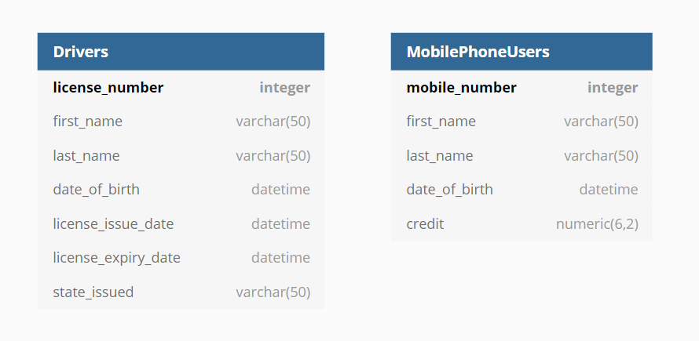
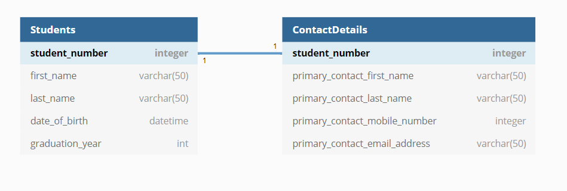
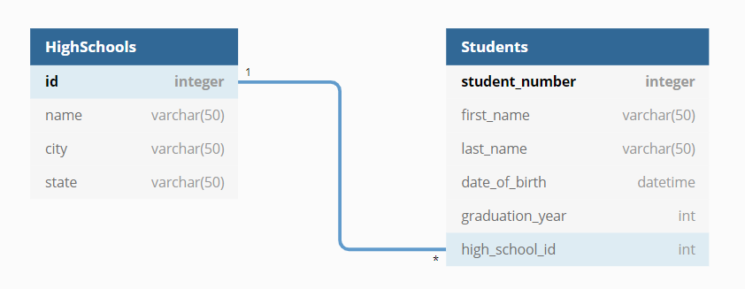
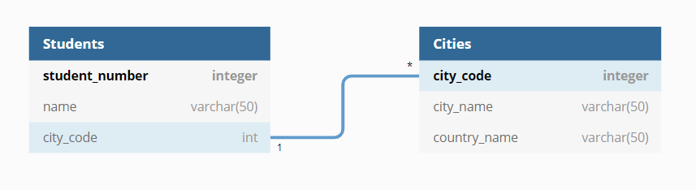

# Developer Workbook - Database Systems. Term3 Assignment 1 T3A1

# Question 1

A database table in a relational database is like a grid with rows and columns. 
Each row is made up of a data record and in each column refers to a particular attribute that the records all have. The attribute has both a name and a data type.
Entries in a particular column are constrained to the datatype of the column's attribute and the column names cannot be duplicated in the same table. 

Tables can have an important feature called a Primary Key. Primary keys are both unique and not null, and are used as a way to uniquely identify a tuple/row in the table. 
They can consist of one or multiple columns. For example, a driver license number can uniquely identify a driver and a mobile number can uniquely identify a person who owns a mobile.
Therefore, driver license number or mobile number would be suitable as a primary key in a database for storing driver info or mobile phone info respectively.




# Question 2

The three possible relationships between entities in a relational database are *one-to-one*, *one-to-many* and *many-to-many*. 

*One-to-one relationship*: One record/row in a table can only be associated with one record/row in another table, and vice-versa.
For example, a student entity and a contact details entity would have a one-to-one relationship. Each student has only one contact details record and a contact details record
can only belong to one student.



*One-to-many relationship*: One record/row in a table can be associated with many records/rows in another table.
For example: a high-school entity and a student entity would have a one-to many relationship. A high school may have many students enrolled. However, a student may only be enrolled in one high school.




*Many-to-many relationship*: Many records/rows in a table can be associated with many records/rows in another table.
For example: a student entity could be enrolled in many different courses. Like-wise, a single course can have many different students enrolled in it.


Primary keys and foreign keys can be used to create a many-to many relationship between tables.

Now, a many-to-many relationship requires a *joining/bridging table*. This table is used to store a record for each combination of the other two tables.
In our case, this record is the combination of student_number and course_id and this combination describes which student enrolled in which course.
In our example, our joining table would contain two foreign keys which are student_number and course_id. Foreign keys values are constrained in that their value must already exist as a primary key value within another table.
The joining table (Enrolment) will only accept a student_number ID and a course_id combination if the student_number already exists as a primary key entry in the Students table and the course_id already exists as a primary key entry within the Courses table.


# Question 3

Three types of constraints are **check**, **not null** and **foreign key**.

1. The **check constraint** limits the range of values that a particular attribute or set of attributes can have. This constraint ensures that the value entered must satisfy a logical, boolean expression. If the value does not satisfy the expression, it is not inserted into the table.
The constraint helps to ensure that bad data does not mistakenly get inserted into the database table. For example, a CHECK constraint could be that product prices for an online store are greater than 0.
No prices in the store should be 0 or negative so this constraint makes sense. Any negative values would violate this constraint and cause an error. 

2. The **not null constraint**  ensures that a particular column/attribute cannot have a null value in it. This means that the particular attribute for that column must always have a value.
For example, an online could ensure that records in a products table must always have a name by constraining the name attribute to be NOT NULL. 
This means that a record with the name attribute left empty would raise an error.

3. The **foreign key constraint**  ensures that a value in one table must also appear in another table. The table with the foreign key is called the child table and the referenced table is called the parent table.  
The foreign key ensure referencial integrity when new records are inserted.
For example, a table called orders could have a foreign key constraint which refers to another table called products.
An order should always be made for an existing product so the product_no in the orders table should always appear in the product_no column of the products table.


eg. Here is an example of two tables to illustrate the use of constraints. Between the two tables, they use multiple check and not null constraints, as well as a foreign key constraint.

```
CREATE TABLE products (
    product_no integer PRIMARY KEY,
    name text NOT NULL,
    price numeric NOT NULL CHECK (price > 0),
    discounted_price numeric CHECK (discounted_price > 0),
    CONSTRAINT valid_discount CHECK (price > discounted_price)
);

CREATE TABLE orders (
    order_id integer PRIMARY KEY,
    product_no integer REFERENCES products (product_no),
    quantity integer,
    date_of_order date NOT NULL,
    CONSTRAINT valid_quantity CHECK (quantity > 0)
);
```

# Question 4

Data types enforce data integrity by ensuring that all values in a particular column are of the same datatype and of a datatype that makes logical sense.
It would be wrong to have say a column for a customer's name but allow entries that are boolean or integers. A customer name entry of True or 1234 would clearly be an error and therefore should not be allowed.
Furthermore, datatypes can be used to constrain the range of numeric values. For example, the data type tiny int could be used for the attribute age in years.
Tiny int allows whole numbers from 0 to 255. No human has lived beyond 255 years so this data type makes sense and helps ensure data integrity.

Another way datatypes enforce data integrity is by ensuring the same format is used. 
Without a common format, problems can occur. For example, in the US, the date is written in month/day/year form whereas in most other countries it is day/month/year. 
Sometimes the last 2 digits of the year are used as opposed to all 4 digits. 
In SQL, the data type DATETIME is formatted YYYY-MM-DD HH:MI:SS.
This ensures that all dates and times entered into the database table follow this format so that there are no formatting errors.


# Question 5

The CREATE TABLE keywords are used in the Data Defintion Language (DDL) command which allows for creating a table.
Along with those keywords, we specify the name of the table and the column definitions. Each column has a name and a datatype.
For example. 

```
CREATE TABLE employees (
    id            INTEGER       PRIMARY KEY,
    first_name    VARCHAR(50)   not null,
    last_name     VARCHAR(50)   not null,
    dateofbirth   DATE
    city          VARCHAR(50)   not null,
    country       VARCHAR(50)   not null,
);
```

The UPDATE and SET keywords can be used as part of a Data Manipulation Language (DML) command which modifies existing records in a table if they satisfy a condition.
It is structured like this:
```
UPDATE table_name
SET column1 = value1, column2 = value2, ...
WHERE condition;
```

An example could be setting the country value to be 'Australia' when the city value is either 'Sydney', 'Melbourne' or 'Gold Coast'.
The SQL command would be
```
UPDATE employees
SET country='Australia'
WHERE city IN ('Sydney', 'Melbourne', 'Gold Coast');
```

The DELETE operator is used along with a WHERE clause to remove particular records from a database.
For example. we may only want Australian employees in our database table and we therefore want to delete all employee records who are not from Australia.

Hence we could write
```
DELETE FROM employees
WHERE country != 'Australia'
```


# Question 6

The inner join combines the records from two tables tables based on a condition. Usually the condition tested is that a field in one
table and the field in the other table have the exact same value. In that case, the record from one table and the other table are combined to form a new record in the results table.
In other words, the inner join is used on two tables (eg. left_table and right_table) and creates a new resulting table by finding all pairs of rows in left_table and right_table that satisfy the join condition.
Only when the join condition is satisfied will the column values of each matched pair in left_table and right_table be combined to form a row in the resulting table.


The syntax looks like:
```
SELECT left_table.column_one, right_table.column_one, left_table.common_field,...
FROM left_table
INNER JOIN right_table
ON left_table.common_field = right_table.common_field;
```
As can be seen from the syntax above, the INNER JOIN between the two tables only occurs when the value of the attribute 'commonfield' in left_table is the same as the value of the attribute 'commonfield' in right_table.
When this is the case, the record from left_table and the record from right_table are joined and form a new record.

# Example: 



We can perform an inner join on the student and city tables because they both share a common field of city_code. 
The inner join could be used to help use find out which country each of the student's belong too.