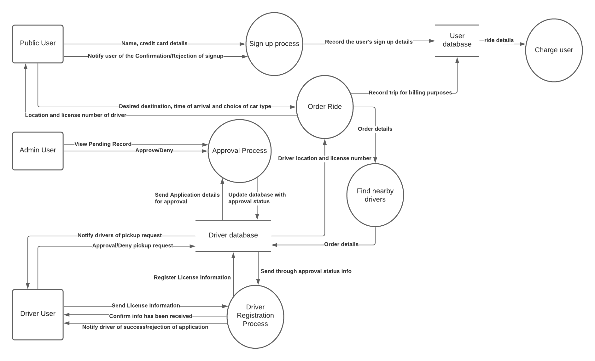

# Developer Workbook - Database Systems. Term3 Assignment 1 T3A1

# Question 1.

# Question 2.

# Question 3.

The organisation I chose was Udemy.com

In Udemy.com, you can add products to a shopping cart. This is a service on the Udemy.com website.
The front-end is implemented using ReactJS. ReactJS allows developers to create large web applications that changes data without having to reload the webpage.
This would make sense to use in Udemy.com given that multiple Udemy courses can be bought and buying each course would alter the total cost data of the shopping cart.
ReactJS can also be used on mobile devices (Reactive Native) such as IOS and Android. This allows for Udemy to be available in app form.
Finally React guarantees stable code. This is done by making sure that developers just need to modify an object's state before making changes. This ensures only those particular
objects that are modified will be updated after the changes are made. This way, code stability and continuous app performance is assured.

Udemy.com uses a NoSQL kind of database called Redis. NoSQL makes sense for Udemy.
We use NoSQL over SQL when flexibility is important such as when you are constantly adding new features, functions and data types over time.
This is the case for Udemy since there are often different special offers, sales and new courses being added every day.
If Udemy used an SQL database for this then lots of time would be wasted on defining what type of data needs to be stored in advance and on designing the data model to accomidate all
the new changes because the changes would impact many different parts of the application.
Also, you can use NoSQL when data consistency and ACID compliance is not important. In Udemy, each course has no stock limit so each one can be bought an infinite amount of times
and the order that users buy each course does not matter. The opposite scenario would be a bank's database where the order of transactions in that database does matter. If only part of a transaction is performed when another transaction starts, then a user's account balance could be 
left in an inconsistent state which could lead to major problems. 
Therefore, Udemy is well suited to using a NoSQL database like Redis because of the flexibility it provides and because it does not need ACID compliance.

